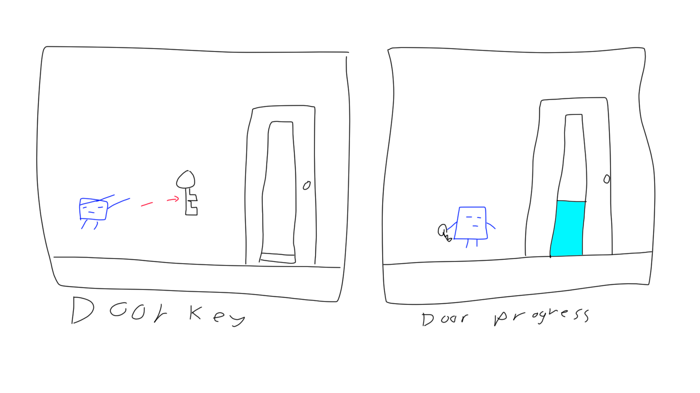
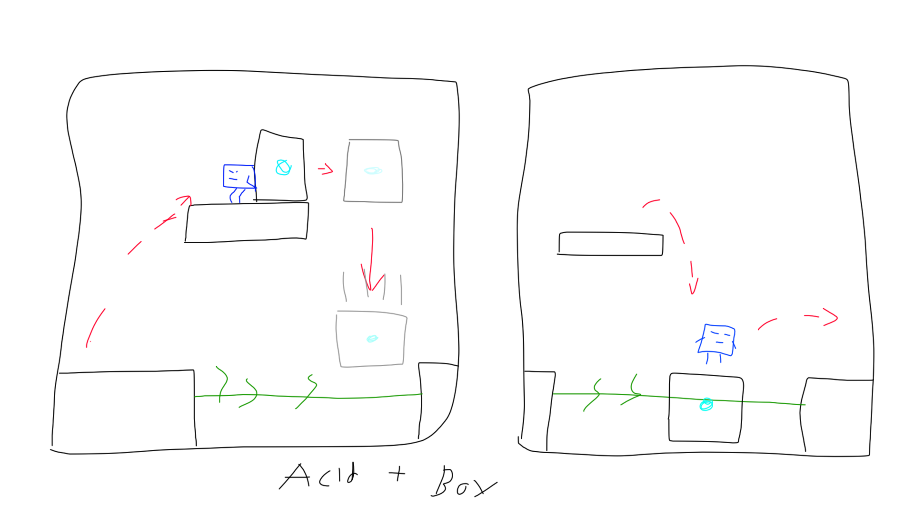
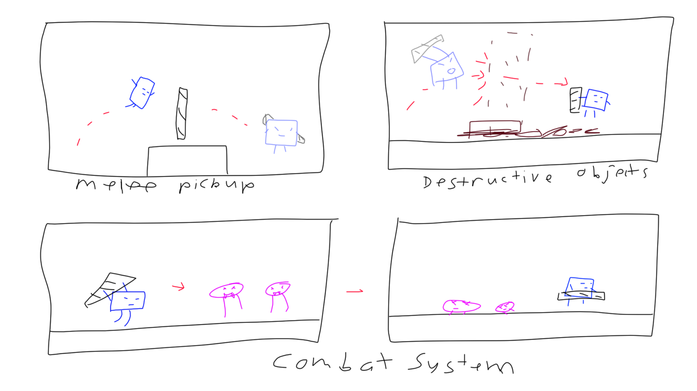
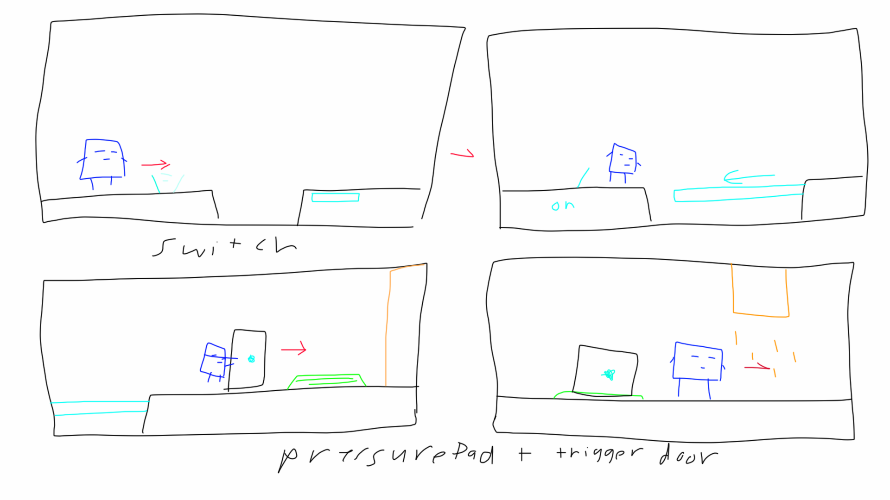
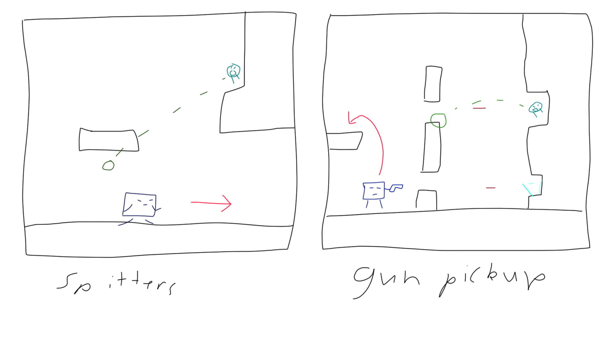
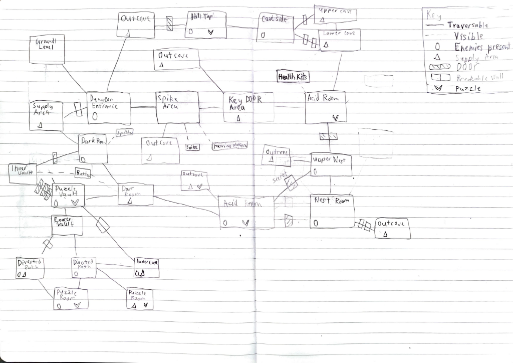

[](https://classroom.github.com/a/YyUO0xtt)
# COMP2150  - Level Design Document
### Name: Takaaki Chi
### Student number: 47887729 

This document discusses and reflects on the design of your platformer level for the Level Design assessment. It should be 1500 words. Make sure you delete this and all other instructional text throughout the document before checking your word count prior to submission. Hint: You can check word count by copying this text into a Word or Google doc.

Your document must include images. To insert an image into your documentation, place it in the "DocImages" folder in this repo, then place the below text where you want the image to appear:

```

```

Example:


## 1. Player Experience (~700 words)
Outline and justify how your level design facilitates the core player experience goals outlined in the assignment spec. Each section should be supported by specific examples and screenshots of your game encounters that highlight design choices made to facilitate that particular experience.

### 1.1. Discovery
The Level begins with discovery, for the level waiting to be explored. The player learns about the main mechanics and hazards and how they can synergise with each other. An example is the first section. In the first section the player is introduced to basic platforming and a generous amount of health pickups to help familiarise the basic movements and combat systems. As the player progresses, they are introduced to new hazards individually to allow the player to understand their behaviour. The placement for checkpoints before and after hazardous areas allows the player to encounter the mechanics without punishing them too excessively. This allows the player to play around with the mechanics before moving on.

An example of this is the introduction to section 1 has a basic enemy that the player must manoeuvre around in order to not take damage. This introduces the movement and enemy to the player.

### 1.2. Drama
The level maintains an intense dramatic curve with a variety of sections holding tension and relief throughout. This helps keep the player engaged as they go through each section. The player experiences a gradual increase in enemy placement and platforming, with calm areas such as hidden health caches sprinkled throughout with the option to retreat to a safer position. The addition of a different enemy variety such as the spitters and areas with high enemy density and traps create intense moments for the player and tests their reactions and strategies to minimise the risk of failure. Through moments that heighten tension this allows the player to find the need to retreat or find a safer area more satisfying. This helps the player maintain engagement and prevents fatigue.

### 1.3. Challenge
The main challenges within the level revolves around precise platforming, combat and puzzle solving. To control the difficulty curve, the level takes into consideration the mechanics of enemies and enemy placement, this is combined with a gradual increase in difficulty for precise platforming and puzzles. For example the section 2 gives insight into the mechanisms that could be introduced such as trap doors and a new enemy type (the spitter) that is more easily countered using the gun awarded for completing the section, and in section 3 the player experience the combination of both the puzzle solving to engage the enemy to make the section easier. This tests the decision making and combat skills. By combining the mechanics to increase the complexity of challenges provides an opportunity for players to test their skills. The challenges gradually increase while maintaining a fair experience for the player encourages players to persist through challenging sections and rewards the player with a sense of accomplishment. 

### 1.4. Exploration
The level encourages the player to explore through its non linear layout. By incorporating branching paths and optional areas the player may deviate from the main path to discover rewards. This is the most prominent in section 2 with its branching puzzles that can be completed in any order. During the transition to section 2, a new enemy type which can shoot projectiles that can go through walls and a gun pickup makes an appearance, this leads to the introduction of a new combat mechanic, section 2’s main focus is puzzle solving, building on the basic puzzle introduced to the player in section 1, with the addition of platforming and combat layered throughout. This Sections builds upon the puzzle solving aspect with the need to unlock multiple doors through activation of multiple buttons, these can be done in any order. This section is more open than the previous section and introduces a new enemy type making the need to explore for health caches more prominent. Once the puzzle is cleared the player is then rewarded with the gun however gets trapped. This allows the player to theorise how the previous owner of the gun came to be there. This introduces the mechanics of the gun and its potential for shooting far away enemies or elevated enemies more easily. This adds a sense of immersion to the player through audio cue and environmental storytelling.


## 2. Core Gameplay (~400 words)
A section on Core Gameplay, where storyboards are used to outline how you introduce the player to each of the required gameplay elements in the first section of the game. Storyboards should follow the format provided in lectures.

Storyboards can be combined when multiple mechanics are introduced within a single encounter. Each section should include a sentence or two to briefly justify why you chose to introduce the mechanic/s to the player in that sequence.

You should restructure the headings below to match the order they appear in your level.

### 2.1. Passthrough Platforms, Checkpoints, Chompers and Health Kit
Once the player enters the level, they are introduced with a passthrough platform to enter the main dungeon. This introduces them to the view of what they can pass through and what's solid.

Once dropped down they gather a checkpoint audio cue to alert that there is danger nearby, this is when they’re introduced to their first enemy chomper. The player cannot damage the enemy at this point which introduces the platforming element, allowing the player to manoeuvre themselves around the chomper to avoid damage.

Avoiding the chomper they are introduced to with a diverting path, if the player takes this path they are rewarded with a health cache which encourages the need for exploration. 


### 2.2. Spikes and Moving Platforms
the player will notice a moving platform with a floor full of purple spikes, once on the moving platform. This introduces to the player that can platforms may move and the dangers of spikes


### 2.3. Keys and KeyDoor
The player’s eye catches the Key and when the key door visually changes, that hints at the player’s objective.



### 2.4. Acid and Interactable Box
After crossing they are introduced to acid and a box blocking the main path, the player is introduced to both the pushing mechanics of the box and the box’s ability to act as a platform on acid along with a small platforming section



### 2.5. Weapon Pickup (Staff), Destructive object and Combat System
After this the player is introduced to the melee weapon pickup and its mechanic to break certain  pillars and walls. After this the player is reintroduced to the chompers which introduces the melee combat system



### 2.6. One Use Switch, PressurePad and TriggerDoor
A small easy puzzle that shows interactables such as the bridge and interactable objects after completing the puzzle the door opens, this is built upon in later section and prepares the Player.



### 2.7.Spitters and Weapon Pickup (Gun)
the player is introduced to a new enemy type known as the spitter and can’t reach with its melee weapon so is forced to dodge past them

the player is introduced to the gun and a far away switch which frees the player and allows them to dispatch the spitters introduced earlier.
The majority of the core gameplay elements and mechanics are introduced in section 1 however the gun is withheld as in the 2D gamekit example, the player may rely on the gun more, during combat leaving little room for the player to know the mechanics of the melee weapon within combat. This is why the level introduces the gun as a reward later on and its mechanics that demonstrate its effectiveness in puzzles and combat. 




## 3. Spatiotemporal Design
A section on Spatiotemporal Design, which includes your molecule diagram and annotated level maps (one for each main section of your level). These diagrams may be made digitally or by hand, but must not be created from screenshots of your game. The annotated level maps should show the structure you intend to build, included game elements, and the path the player is expected to take through the level. Examples of these diagrams are included in the level design lectures.

No additional words are necessary for this section (any words should only be within your images/diagrams).
 
### 3.1. Molecule Diagram


### 3.2. Level Map – Section 1

### 3.3.	Level Map – Section 2

### 3.4.	Level Map – Section 3

## 4. Iterative Design (~400 words)
Reflect on how iterative design helped to improve your level. Additional prototypes and design artefacts should be included to demonstrate that you followed an iterative design process (e.g. pictures of paper prototypes, early grey-boxed maps, additional storyboards of later gameplay sequences, etc.). You can also use this section to justify design changes made in Unity after you drew your level design maps shown in section 3. 

You should conclude by highlighting a specific example of an encounter, or another aspect of your level design, that could be improved through further iterative design.

## Generative AI Use Acknowledgement

Use the below table to indicate any Generative AI or writing assistance tools used in creating your document. Please be honest and thorough in your reporting, as this will allow us to give you the marks you have earnt. Place any drafts or other evidence inside this repository. This form and related evidence do not count to your word count.
An example has been included. Please replace this with any actual tools, and add more as necessary.


### Tool Used: ChatGPT
**Nature of Use** Finding relevant design theory.

**Evidence Attached?** Screenshot of ChatGPT conversation included in the folder "GenAI" in this repo.

**Additional Notes:** I used ChatGPT to try and find some more relevant design theory that I could apply to my game. After googling them, however, I found most of them were inaccurate, and some didn't exist. One theory mentioned, however, was useful, and I've incorporated it into my work.

### Tool Used: Example
**Nature of Use** Example Text

**Evidence Attached?** Example Text

**Additional Notes:** Example Text


